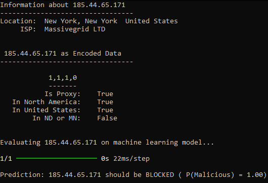
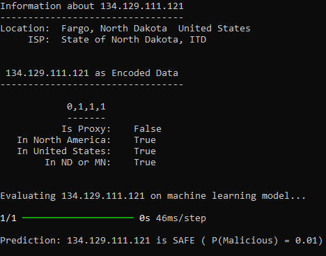
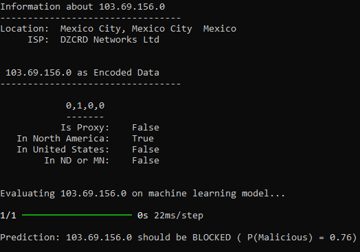

<h2 align="center"> CSCI 403 Geospatial Intrusion Detection Project: Write-Up</h2><h3 align="center"> By Austin Erickson, Cale Voglewede, and Connor Chandler </h3></br>


### Introduction
Geospatial Intrusion Detection Software is critical for securing systems that rely on geospatial data, which is increasingly used in logistics, disaster response, and infrastructure management. This project focuses on creating a system capable of identifying, modeling, comparing, and responding to geospatial-based intrusion, addressing the growing need for security solutions in cybersecurity. The system is composed of three components. The Geospatial Pattern Identification Mechanism uses machine learning to analyze geospatial datasets and extract meaningful patterns from IPs. The Geospatial Pattern Comparison Mechanism evaluates new data by comparing its geospatial elements to stored models, determining similarity levels to identify potential threats. Finally, the Geospatial Intrusion Detection Decision Mechanism integrates comparison results with existing given data to assess whether an intrusion is occurring and triggers appropriate alerts. By implementing these components, this project demonstrates how a comprehensive Geospatial Intrusion Detection Software can enhance security, ensuring the integrity and reliability of geospatial data systems. </br></br>
This project builds on concepts in machine learning and geospatial data analysis to develop an intrusion detection system. Machine learning techniques are pivotal for identifying patterns within geospatial datasets, enabling the system to learn and adapt to threats. Applying these techniques ensures the effective extraction and analysis of geospatial patterns from complex data. The role of IP addresses in geospatial intrusion detection is also a critical focus area. While IP addresses can provide approximate location information, their reliability is often hindered by the use of proxies, VPNs, or dynamic addressing, which obfuscate accurate geospatial mapping. Many prominent organizations, such as the CISA, have detailed  the dangers of obfuscated connections [1]. These limitations highlight the need of combining geospatial intrusion detection with other network security procedures. Nonetheless, by integrating machine learning with geospatial analysis and addressing the challenges of inconclusive IP-based geolocation, we try to showcase the validity and processes of a geospatial intrusion system. 


### Background

When starting the project, the group didn’t have many ideas on where to begin for a geospatial intrusion system. Additionally, the group didn’t have extensive experience with machine learning, making the planning process more difficult with the incorporation of dynamic predictions in the project.  However, the group was able to use three notable resources that helped form the base of the project, allowing the project to be completed with relative ease. 
</br></br>The main resources the group used were:</br>

1. **ip-api** [2]</br>
ip-api is the API that the group decided to utilize when evaluating the geolocation of IP addresses. The main reasons why the ip-api service was chosen was due to it being free for non-commercial use, its simple-to-use JSON response format, and its comprehensive field support. ip-api also includes a proxy field, which returns if the service detects the IP address as a proxy, VPN, or Tor server. In all, the service does an excellent job at returning queries in a quick amount of time and detecting where a device approximately is.</br>

2. **Machine Learning Mastery** [3]</br>
Machine Learning Mastery is the learning resource that the group utilized for adapting the project’s machine learning algorithms. The website is a part of the Guiding Tech Media publisher and is led by Jason Brownlee, PhD, holding a degree in artificial intelligence. The website’s tutorials provide helpful walkthroughs of machine learning concepts and implementations. The group used a total of three tutorials to adapt machine learning to the project, all authored by Brownlee. One was "Your First Deep Learning Project in Python with Keras Step-by-Step" [4]. The tutorial was designed for beginners and explains topics about loading datasets, designing and compiling models, training, and evaluating them. The second was "How to Make Predictions with Keras" [5]. The tutorial covers preprocessing input data to match model requirements and understanding different types of statistical analysis. The third and final tutorial was "How to Save and Load Your Keras Deep Learning Model" [6]. It discussed methods on how to save Keras models to file formats like HDF5 and how to load them for repeated use without compilation. Overall, the tutorials helped the group apply machine learning to analyze data in a sophisticated and fast manner. 

3. **TensorFlow** [7]</br>
TensorFlow is the Python API that the group utilized in order to accomplish machine learning for the project. The API is well known for its software support and performance in machine learning, earning a good reputation among many companies such as Google and Intel. 

### Assumptions

Due to resource and time constraints, the project needed to make many assumptions about how the software would be utilized and what type of problem would be addressed. Altogether, the constraints rendered the project more as a conceptual implementation rather than a realistic one.

The main assumptions we made were:

1. **Objective**</br>
To limit the scope of the project, the group decided to focus on using geospatial data relative to a singular location. While the project could be adapted to handle any generic location, this would increase the feature scope and make the project less feasible to implement. The target location chosen for valid IP addresses was North Dakota and Minnesota, primarily to address possible situations such as a Fargo organization offering local internet services, which could easily have users nearby in Moorhead or another nearby city in Minnesota. Further deviations from this target location for IP addresses include in the United States and then in North America. Accordingly, the data utilized in machine learning is structured according to these attributes, with binary variables representing each of the location scopes.

2. **Training Data**</br>
Due to the niche specification of the project, predefined data that could help address the problem of the project was limited to non-existent in relation to the project’s constraints. Accordingly, data was generated randomly with determined probabilistic frequencies for each scenario that required random generation. Frequencies were chosen to allow the model to predict information more easily due to more visible patterns.  In a more realistic scenario, training data would ideally be gathered from a reputable third-party contractor and be more finely tuned for an organization’s risk assessments.

3. **Secure Program Behavior**</br>
In a more realistic scenario, a geospatial intrusion system would be integrated with other network security software and leave no trace of the defenses utilized within the system (e.g. feature encrypted files for data and model). However, due to the project’s constraints, most of these features would be unfeasible to implement in the given amount of time. Instead, Python modules and transparent file formats (e.g. .txt, .csv) were used for simplicity. Efforts were made for the project to run smoothly as an application, even for its experimental state.</br>

### Program Overview

The following will list all the Python modules used to execute the program, their purpose, and the essential details regarding their implementation.</br>

- **geospatial_intrusion.py**
  - *What It Addresses*
    - Provides a command line interface that allows use of the project’s modules
  - *Formation Process*
    - Came from the need to use the program modules as a cohesive program
  - *Essential Details*
    - Provides basic error checking for user inputs

- **data_gen.py**
  - *What It Addresses*
    - Provides a .csv file for machine learning training with semi-random generated values
  - *Formation Process*
    - Needed a data source for machine learning in order to make predictions based off of IP addresses
	- Probabilities generated in the data needed to define patterns for the model
  - *Essential Details*
    - Data for an IP is represented by five binary values. The following indicates what each bit means.</br>
	```
	(from left to right, describes if bit is active)
    1st Bit - IP address marked as a proxy, VPN, etc.
    2nd Bit - IP address marked as being in North America
    3rd Bit - IP address marked as being in the United States
    4th Bit - IP address marked as being in North Dakota or Minnesota
    5th Bit - IP address marked as being illegitimate, for ML labeling
	```
	- IP addresses marked as a proxy are always deemed malicious due to obfuscating network location
	
- **ml_learning.py**
  - *What It Addresses*
    - Provides machine learning model to make predictions for future IP address inputs
  - *Formation Process*
    - Used Machine Learning Mastery tutorials and adapted algorithms for the project’s main problem of binary classification
  - *Essential Details*
    - Provides a data file (.h5) that can store the model on disk and can be used to make predictions without recompiling the model

- **ip_data.py**
  - *What It Addresses*
    - Provides a class that can store the attributes of an IP address
  - *Formation Process*
    - Came from the need for a more seamless print method in the code and storing the IP data in a more accessible way
  - *Essential Details*
    - Represents a class module

- **ip_eval.py**
  - *What It Addresses*
    - Evaluates IP addresses based off of the machine learning model, either from a list or user input
  - *Formation Process*
    - Need separate program module for executing the main function of the program (binary classification of an IP address)
  - *Essential Details*
    - Accepts IPv4 and IPv6
	- Module that utilizes responses from ip-api for data analysis
	- Can handle a set of IP addresses through a text file in the data folder

### Results
The project, despite its limited scope, proved successful in being able to predict which IP addresses should be blocked or allowed based on geospatial information. The sample data, analyzed by machine learning, was successfully mapped to a sigmoid function, which allowed for accurate binary classification. </br></br>

For proxy IP addresses, the probability of the address being malicious was 100%, adhering to the training data not including any proxy IP as a safe connection. </br>

<p align="center">
   </br>
</p> </br></br>

For IP addresses local to North Dakota or Minnesota, they are predicted to be safe like intended. </br>

<p align="center">
   </br>
</p> </br></br>

And, for IP addresses not local to the area, the addresses are marked as malicious with less certainty. </br>

<p align="center">
   </br>
</p> </br></br>

In all, the project proves that a geospatial intrusion system could be effective in limiting network connections based on geospatial information. The group was able overcome inexperience and the complexity of the topic through accessible resources and powerful programming libraries, demonstrating the viability of the software being implemented for other organizations' network security protocols. 

### Conclusions and Takeaways
While the project was successful in proving the potential viability of a geospatial intrusion system, further research and experimentation into the concept is likely needed to demonstrate effectiveness in reducing malicious activity. Like stated earlier, a geospatial intrusion system should preferably be integrated with other network security systems due to limitations with obfuscation. Additionally, the training data and models used for a geospatial intrusion system would have to be finely tuned for accuracy, or else a network may be too lenient or restrictive in allowing certain connections. Despite the limitations, a geospatial intrusion system could be a valuable tool for the ensuring greater cybersecurity for an organization. If the group attempted to do this project again, the flexibility of the program and accuracy of the model would be focused on. </br>

### References

<p style="padding-left: 2em; text-indent: -2em;">
  [1] “Defending against malicious cyber activity originating from tor: CISA,” Cybersecurity and Infrastructure Security Agency CISA, https://www.cisa.gov/news-events/cybersecurity-advisories/aa20-183a (accessed Dec. 18, 2024). </br>
</p>

<p style="padding-left: 2em; text-indent: -2em;">
[2] ip-api, https://ip-api.com/ (accessed Dec. 18, 2024). </br>
</p>

<p style="padding-left: 2em; text-indent: -2em;">
  [3] MachineLearningMastery, https://machinelearningmastery.com/
 (accessed Dec. 18, 2024). </br>
</p>


<p style="padding-left: 2em; text-indent: -2em;">
[4] J. Brownlee, "Your first deep learning project in python with keras step-by-step",
  	https://machinelearningmastery.com/tutorial-first-neural-network-python-keras/ (accessed Dec. 18, 2024). 
</p>

<p style="padding-left: 2em; text-indent: -2em;">
[5] J. Brownlee, "How to make predictions with keras", https://machinelearningmastery.com/how-to-make-classification-and-regression-predictions-for-deep-learning-models-in-keras/ (accessed Dec. 18, 2024). 
</p>

<p style="padding-left: 2em; text-indent: -2em;">
[6] J. Brownlee, "How to save and load your keras deep learning model", https://machinelearningmastery.com/save-load-keras-deep-learning-models/ (accessed Dec. 18, 2024). 
</p>

<p style="padding-left: 2em; text-indent: -2em;">
[7] TensorFlow, https://www.tensorflow.org/ (accessed Dec. 18, 2024). 
</p>

